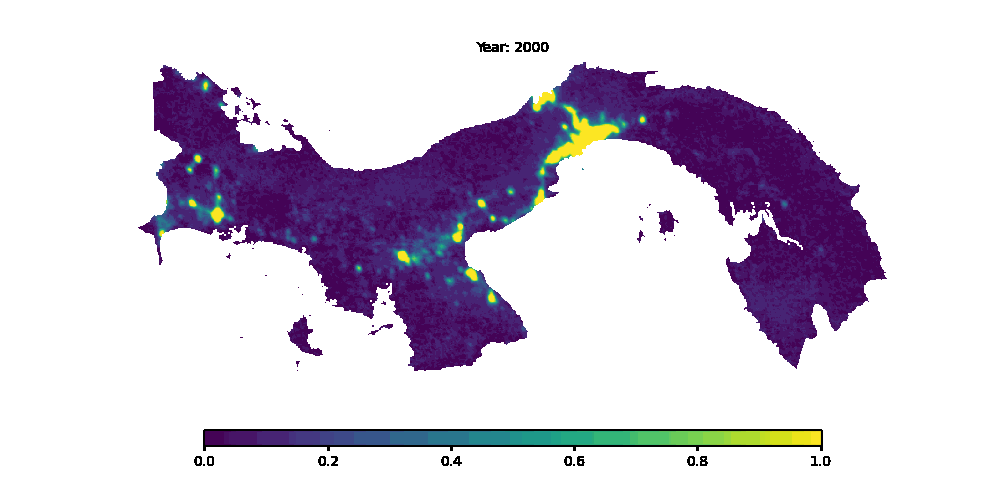

# Satellite Data Visualization
This project aims to visualize open source data from the **[Earth Engine Data Catalog](https://developers.google.com/earth-engine/datasets)**. For this purpose, it uses information about climate change indicators for Central American and Caribbean countries.

The database covers six climate change indicators, which include variables related to agricultural changes, air temperature, deforestation, pollution, drought, and water scarcity. The high level of detail of these indicators provides an important foundation for tracking the impact of climate change indicators on the selected countries. A web application, and a containerized postgresql database is constructed to manage the data and allow retrieval for the images. 

The website has 5 main pages:

1. Introduction
2. Single Raster
3. Raster Comparison
4. Timelapse
5. Display HTML

The first one introduces the dataset used and the overall objective of the project. The second one visualizes a single raster image given a country, an environmental index, and a year, from now raster key. There's availability to approximately 20 years of data, with limited access to specific indices, such as Cropland, drought and precipitation. 

The third page allows a side-by-side comparison between two selected raster keys. The timelapse tab allow the user to visualize an animated visualization of the evolution of the selected environmental index for a given country and the final page leverages a containerized postgresql instance with the images being read from the database and served to the user, without being processed in real time. To enable this, a standalone process (or through localhost) can be spun up in a server to enable this behavior. 

An example of Panama's Night-time lights timelapse is shown below:

